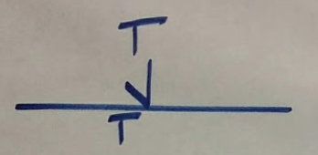
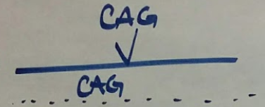
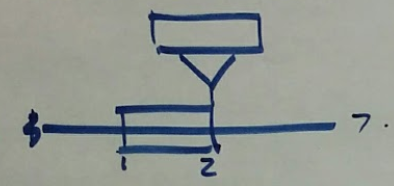
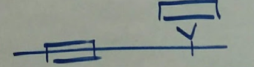
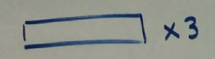

# Single nucleotide repeat


```
{
    "LOC34":{
        "id":"LOC34",
        "start":11850846,
        "end":11850846
    },
    "clinvar:223138":{
        "id":"clinvar:223138",
        "location_id":"LOC32"
        "sequence": "A"
        "copies": 5
    },
    "clinvarallele:223138":{
        "id":"clinvar:223138",
        "location":"LOC34",
        "state":"clinvar:223138"
    }
}
```

# Short tandem repeat


```
{
    "LOC34":{
        "id":"LOC34",
        "start":11850846,
        "end":11850846
    },
    "clinvar:223138":{
        "id":"clinvar:223138",
        "location_id":"LOC32"
        "sequence": "CGG"
        "copies": 5
    },
    "clinvarallele:223138":{
        "id":"clinvar:223138",
        "location":"LOC34",
        "state":"clinvar:223138"
    }
}
```

# Tandem duplication


```
{
    "LOC32":{
        "id":"LOC32",
        "interval": {
            "start": {max: 61543299},
            "end": {min: 61548462}},
        "sequence_id":"NC_000001.10",
    },
    "LOC33":{
        "id":"LOC33",
        "start":11850846,
        "end":11850846
    },
    "clinvar:223138":{
        "id":"clinvar:223138",
        "location_id":"LOC32",
        "identity":null
    },
    "clinvarallele:223138":{
        "id":"clinvar:223138",
        "location":"LOC33",
        "state":"clinvar:223138"
    }
}
```

# Tandem copy number increase, multiple copies


```
{
    "LOC34":{
        "id":"LOC34",
        "interval": {
            "start": {max: 61543299},
            "end": {min: 61548462}},
        "sequence_id":"NC_000001.10"
    },
    "clinvar:223139":{
        "id":"clinvar:223139",
        "location_id":"LOC34",
        "identity":null,
        "copies":5
    }
}
```

# Duplication with Translocation, same chromosome


# Duplication with Translocation, different chromosome


# Duplication with unknown location


```
{
    // Location
    "LOC32":{
        "id":"LOC32",
        "interval":{
            "start":{max: 11850846},
            "end": {min: 11867218}},
        "sequence_id":"NC_000001.10",
    },
    // State
    "clinvar:223138":{
        "id":"clinvar:223138",
        "location_id":"LOC32",
        "copies": {min: 5, max: 8}
    }
}
```
